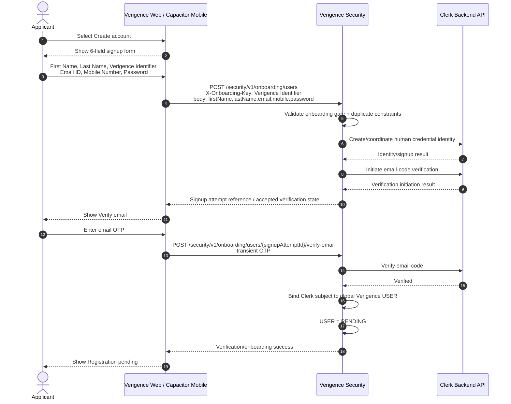
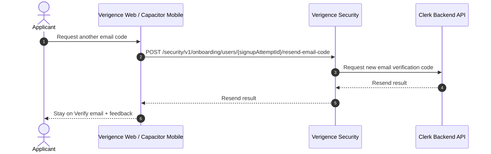
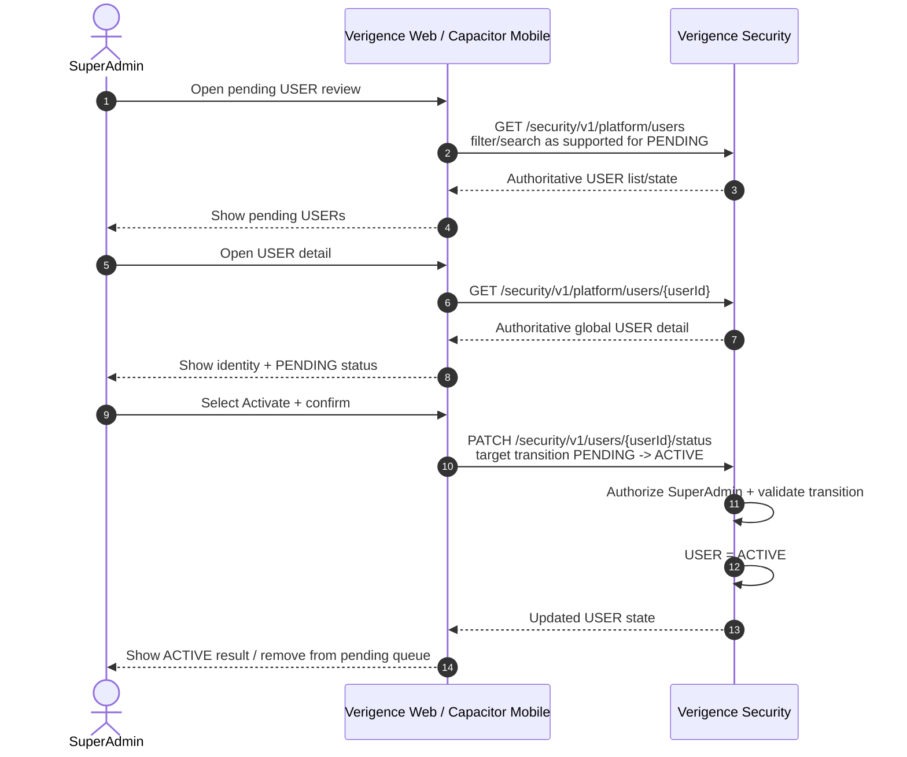
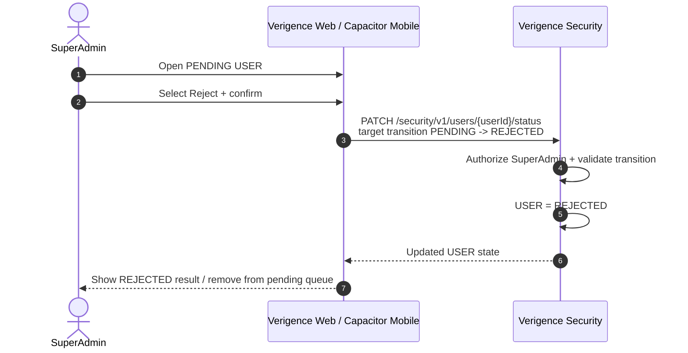
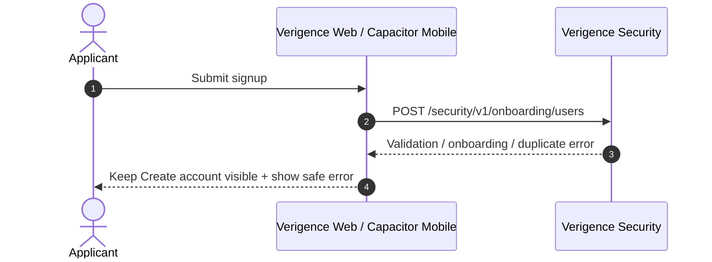
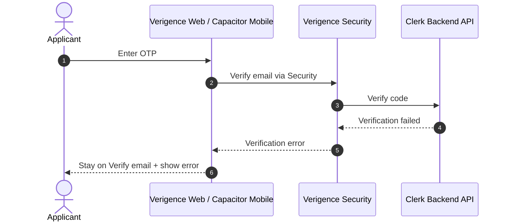

# UC-001 — User Onboarding Sequence Diagrams

**Status:** DRAFT FOR DESIGN REVIEW  
**Date:** 2026-08-19

## 1. Component boundary

The same Verigence React application is used for browser and Capacitor mobile. For UC-001 both clients use Verigence Security APIs. Neither client calls Clerk.

```text
Browser Web ------------------+
                              |
Capacitor Android / iOS ------+----> Verigence Security ----> Clerk Backend API
```

Audit Core and DI are intentionally absent from the UC-001 signup/OTP path.

---

## 2. Signup + email OTP + PENDING



### Important rules

- Password and OTP are transient.
- No Clerk token passes through the client.
- No `tenantId` appears in the signup path.
- No role/Dealer/Outlet selection appears in the signup path.
- Optional Device/Geo context, if supplied by a client, is not required, persisted or evaluated as a Phase-1 gate.

---

## 3. Email-code resend



**OPEN DECISION:** The reviewed 19-Aug Security documents do not define client-visible resend countdown, throttle interval or maximum resend count. The design must not invent those values.

---

## 4. SuperAdmin activation



The activation UI does **not** assign Tenant, role, Dealer/Outlet or permissions.

**OPEN DECISION:** The exact PATCH request envelope for the target status must be taken from the deployed Security API contract; this design does not invent the JSON field name.

---

## 5. SuperAdmin rejection



**OPEN DECISION:** A mandatory rejection reason is not defined in the reviewed 19-Aug source of truth and therefore is not added to UC-001.

---

## 6. Signup error — onboarding request rejected



The client must not translate a Security failure into a locally invented account state.

---

## 7. OTP verification error



The UI does not reveal Clerk implementation details.

---

## 8. Decision conflict / stale admin view

```mermaid
sequenceDiagram
    autonumber
    actor SuperAdmin
    participant AdminUI as Verigence Web / Capacitor Mobile
    participant Security as Verigence Security

    SuperAdmin->>AdminUI: Confirm Activate or Reject
    AdminUI->>Security: Request PENDING status transition
    Security->>Security: USER is no longer eligible for requested transition
    Security-->>AdminUI: Conflict / current authoritative state
    AdminUI->>Security: Refresh USER detail/list
    Security-->>AdminUI: Current state
    AdminUI-->>SuperAdmin: Show current state; do not repeat silently
```

---

## 9. Post-activation boundary

After activation, UC-001 may return the person to the existing Sign In entry. Canonical login is a later use case:

```text
POST /security/v1/auth/login
body: identifier + password
```

There is no `tenantId`, mandatory Device/Geo or Phase-1 TOTP/MFA in that login request.

Tenant context, operating role, Dealer/Outlet and permissions are resolved separately after global identity authentication and are outside UC-001.